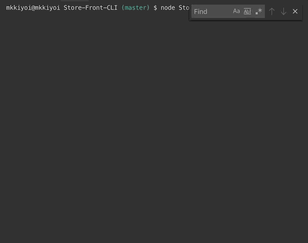

# Store-Front-CLI
Store-Front-CLI is a command line interface Amazon-like store front facilitating customer purchases and inventory management using MySQL and Node. 

## __Using Store-Front-CLI__
* There are three different store interactions: customers, managers, and supervisors.
  * The customer can use the command `node Store_Front_Customer.js` to access the customer view. 
    * This allows customers to view the products available and buy a certain amount of a product.
    * Example of using the customer view: 
      

  * The manager can use the command `node Store_Front_Manager.js` to access the manager view. 
    * Managers can access one of four options: 
      * `View Products for Sale`
        * Returns a table of all of the products currently available with their id number, name, price, and quantity left.
        
      * `View Low Inventory`
        * Returns a table of all of the products with quantity 5 or less and their id number, name, price, and quantity left.
        
      * `Add to Inventory`
        * Adds a specified amount to the quantity of the given product.
        
      * `Add New Product`
        * Adds a new product to the inventory.
        

  * The supervisor can use the command `node Store_Front_Supervisor.js` to access the supervisor view. 
    * Supervisors can access one of four options: 
      * `View Product Sales by Department`
        * Returns a table of all of the departments with their ID, Name, OverHeadCosts, ProductSales, and TotalProfit.
        
      * `Create New Department`
        * Creates a new department in the departments table.
        

        
## __Node Modules used in Store-Front-CLI__
* [inquirer](https://www.npmjs.com/package/inquirer)
* [dotenv](https://www.npmjs.com/package/dotenv)
* [mysql](https://www.npmjs.com/package/mysql)

## __Assets__
* Javascript for the customer can be found [here](Store_Front_Customer.js).
* Javascript for the manager can be found [here](Store_Front_Manager.js).
* Javascript for the supervisor can be found [here](Store_Front_Supervisor.js).
* MySQL database code can be found [here](Store_Front.sql)

